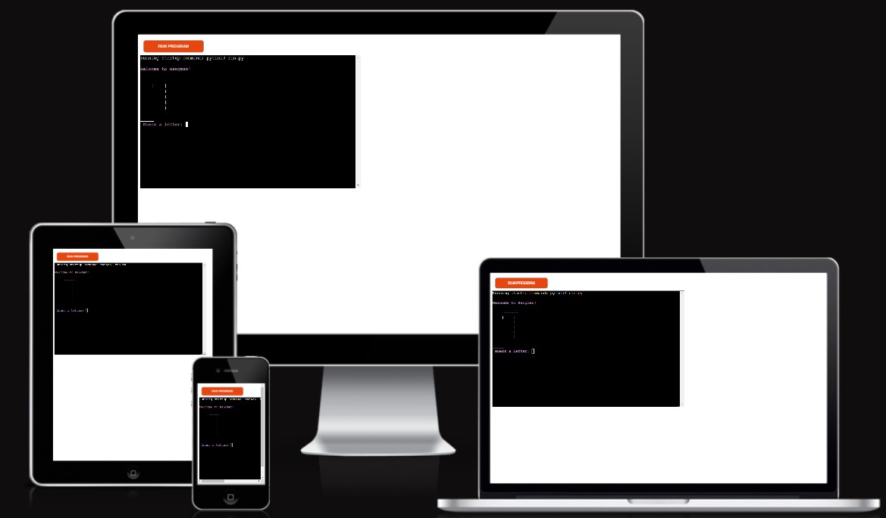
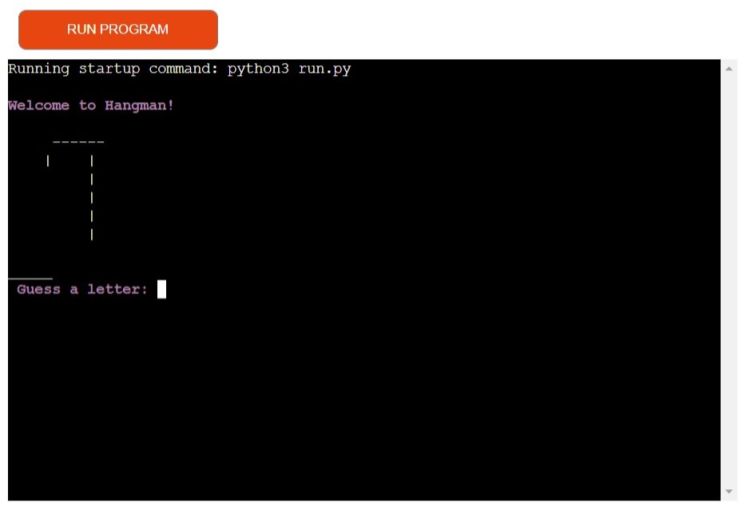
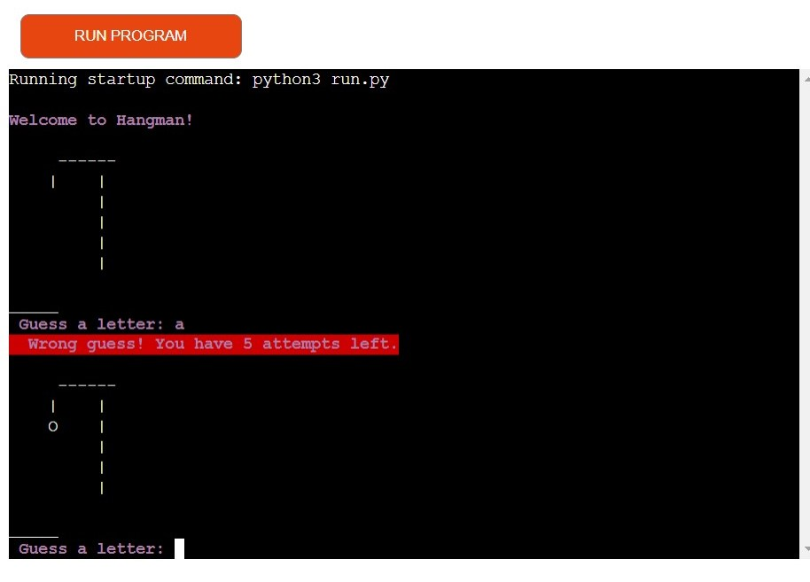
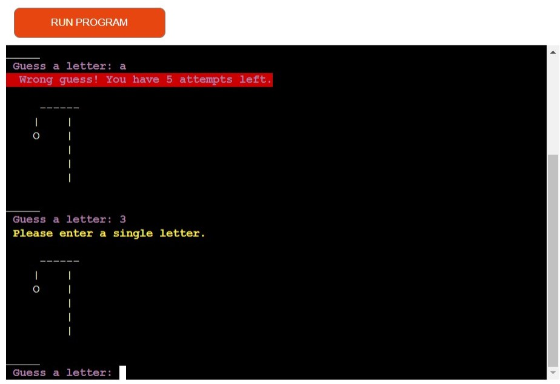
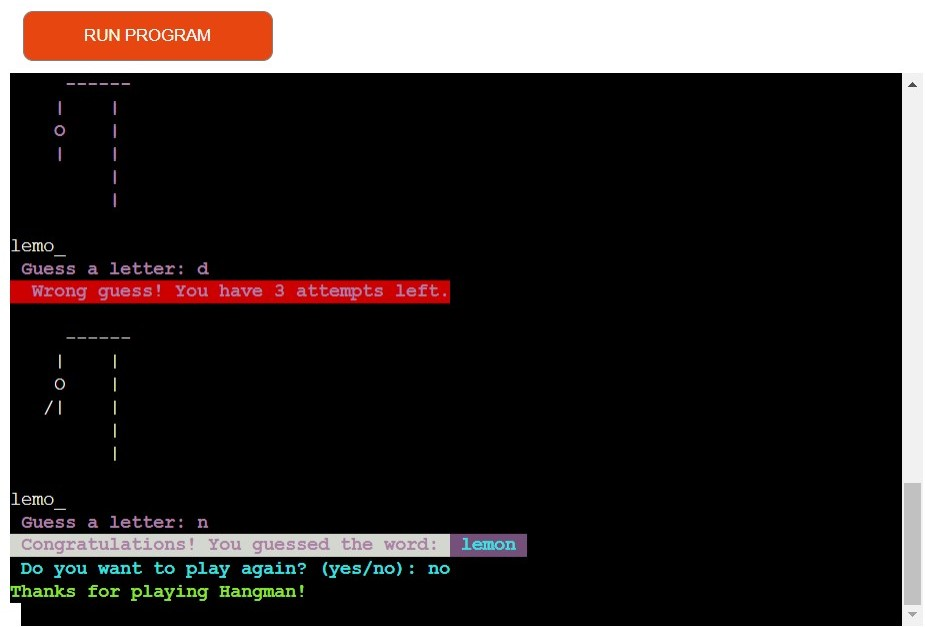
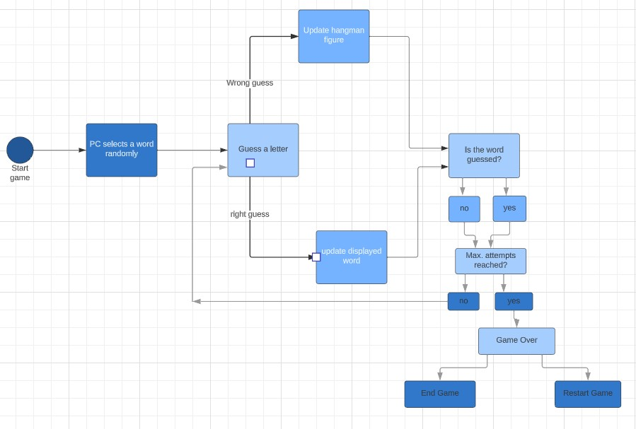

# HANGMAN 

 The Hangman Game is a classic word-guessing game implemented in Python. In this game, the player's objective is to guess a hidden word by suggesting letters one at a time. The game provides a visual representation of a hangman figure that evolves with each incorrect guess, adding an element of suspense and challenge.

 

 [Here's the link to the live version of my project](https://hang-man-erika-bfd2418b41ff.herokuapp.com/)

 ## How to play
 - The game selects a word, and the player starts with a blank word with underscores representing each letter.

- The player guesses a letter by entering it via the keyboard.

- If the guessed letter is in the word, it is revealed in the word display; otherwise, the hangman figure evolves.

- The player continues guessing until they either correctly guess the word or run out of attempts.

- After the game ends (win or lose), the player can choose to restart and play again.

## Features
- Word Selection: The game randomly selects a word from a predefined list or dictionary. Players must guess this word letter by letter.

  

- Visual Feedback: The game displays an ASCII art hangman figure that progressively appears as the player makes incorrect guesses. This adds an exciting visual element to the game.

  

- User Input Validation: The game validates user input to ensure it's a single letter. If the input is invalid, the game prompts the player to try again.

  
- Word Display: The game displays the word with underscores for unguessed letters and reveals correct guesses. This provides players with feedback on their progress.

- Attempts Limit: The player has a limited number of attempts to guess the word correctly. If they exceed this limit, they lose the game.

- Restart Option: After winning or losing a game, the player has the option to restart and play again, providing endless entertainment.

  

- Colorama: I installed colorama in order to give the game color features to pop up the wrong answers, or any other prompt. 

## Flow chart

- Start Game: The game begins.
- Select a Word: A random word is chosen from a predefined list.
- Display Word: The word is displayed to the player with underscores for unguessed letters.
- Player Guesses a Letter: The player enters a letter guess.
- Is the Letter Correct?: The game checks if the guessed letter is correct.
- If yes, the displayed word is updated with the correct letter.
If no, the hangman figure evolves, and the game checks if the word is guessed.
- Is Word Guessed?: The game checks if the entire word is guessed.
- If yes, the player wins.
- If no, the game continues.
- Max Attempts Reached?: The game checks if the player has reached the maximum allowed incorrect attempts.
- If yes, the player loses.
- If no, the game continues.
- Game Over: The game ends.
- Restart Game: The player can choose to restart the game.
- End Game: The game officially ends.

## Testing

I tested this project as it follows: 
- Tested on GitPod terminal 
- Ran a test on PEP8 lintern and check there were no errors to fix
- Tested on the Code Institute's Heroku terminal

### Bugs
No bugs found 

### Validator testing
- Pep8
   - No error was returned from PEP8 Validator

## Deployment
The project was deployed using Code Institute's mock terminal for Heroku

- Steps for deployment on Heroku:
  - Fork or clone this repository
  - Create a new Heroku app 
  - Set the buildpacks to `python` and `node.js` (in that order)
  - Link the Heroku app to the repository
  - Click on Deploy

- Steps for deployment on GitPod:
    - The site was deployed to GitHub pages. The steps to deploy are as follows:
    - In the GitHub repository, navigate to the Settings tabgit From the source section drop-down menu, select the Master Branch
    - Once the master branch has been selected, the page will be automatically refreshed with a detailed ribbon display to indicate the successful deployment. 
    
    [Here's the link to my deployed project on GitHub]( https://ekrasutzky.github.io/hang-man-P3/)
# Credits
- Code Institute for the deployment terminal.
- LucidChart for the flowchart. 
